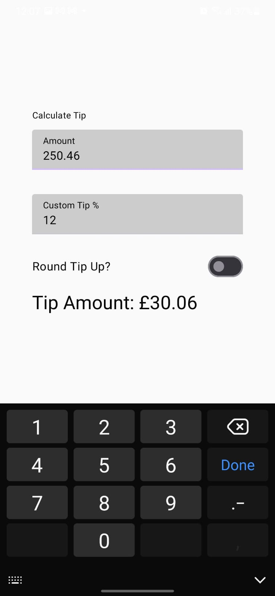
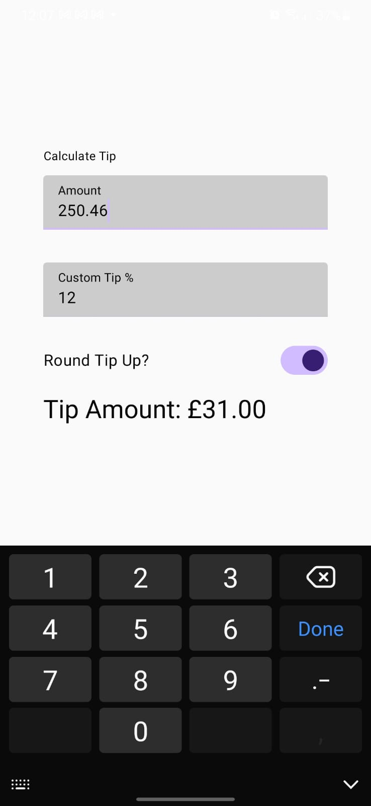

# Tip Calculator

This is a simple Tip Calculator application built using Jetpack Compose, designed to demonstrate state management principles.

## Features

* Calculate tips based on bill amount and percentage.
* (You can add more specific features here if you have any, e.g., "Split bill among multiple people", "Custom tip percentages", etc.)

## Screenshots

Here are some screenshots of the application in action:

| Screen 1 | Screen 2 |
|----------|----------|
|  |  |

## How to Use

(Explain how to run or use your application here. For example, if it's an Android app, you might say something like: "To run this application, clone the repository and open it in Android Studio. Then, build and run the project on an emulator or a physical device.")

## Technologies Used

* Jetpack Compose
* Kotlin
* Android Studio

## Getting Started

1.  **Clone the repository:**
    ```bash
    git clone [https://github.com/Rohxn16/Tip-Calculator.git](https://github.com/Rohxn16/Tip-Calculator.git)
    ```
2.  **Open in Android Studio:**
    Navigate to the cloned directory and open the project in Android Studio.
3.  **Build and Run:**
    Build the project and run it on an Android emulator or device.
